#### FLEX Box 

Flex Box কাজ করে parent-child এর উপর ভিত্তি করে । 

Flex-box one-dimentional হয়ে থাকে । 

parent কে আমরা display : flex করবো 

Flex box এ flex direction by default row wise থাকে ।

আর যদি আমরা flex direction by default col wise দেই তাহলে col wise হয়ে যাবে 

flext-direction : row-reverse 
flex-direction : col-reverse 

আমাদের parent এর child গুলো যখন flex-direction : row থাকে তখন main axis row-wise হয় 

আর আমাদের parent এর child গুলো যখন flex-direction : col থাকে তখন main-axis col-wise হয় । 

cross-axis depend করে main-axis এর উপর কারন cross-axis সবসময় main-axis এর perpendicular হয়ে থাকে । 

Justify-content সবসময় main-axis এর around এ হয় 
আর align-item সবসময় cross-axis এর উপর ভিত্তি করে হয় । 

space-evenly হলো প্রতিটা children এর মাঝামাঝি দূরত্ব সমান থাকে । 
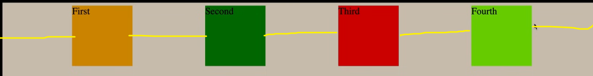

space-around এর margin টা কাজ করে মূলত এভাবে 

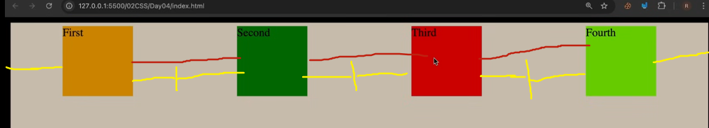
এভাবে প্রথম আর শেষের content এর দূরত্ব সমান আর বাকি content এর মর্ধবর্তী দূরত্ব এই দুইপাশের দূরত্বর সমান । 
space-between হলো প্রথম দুইটা একেবারে কিনারে চলে যাবে কিন্তু বাকিগুলোর মাঝখানে সমান দূরত্ব থাকবে 
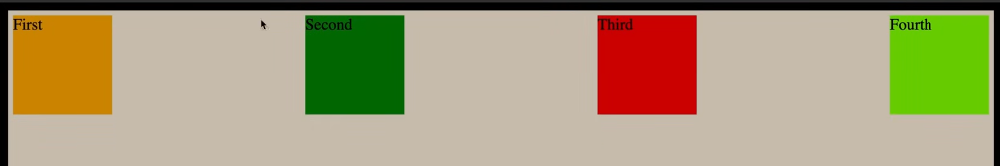
###### Flex Wrap 
children গুলো নিচে চলে যাবে যখন screen এ আর জায়গা পাবে না । 
By default এটা no-wrap হয়ে থাকে । flex-wrap : wrap 
flex-wrap : wrap-reverse;

###### Gap 
আমরা children গুলোকে margin না দিয়ে parent এ gap :10px দিয়ে দিলে তা প্রতিটা children এ 10 px হয়ে যাবে । 

###### Flex grow 
flex-grow প্রথম children কে ১ দিয়ে দিয়েছি আমার available space সে নিয়ে নিবে আর যদি ২ দিয়ে দেই আরেকটা children  তাহলে ২য় children নিয়ে নিবে একটু বড় আকারে । 
Flex-grow হলো খালি space টা নিয়ে নিবে। 
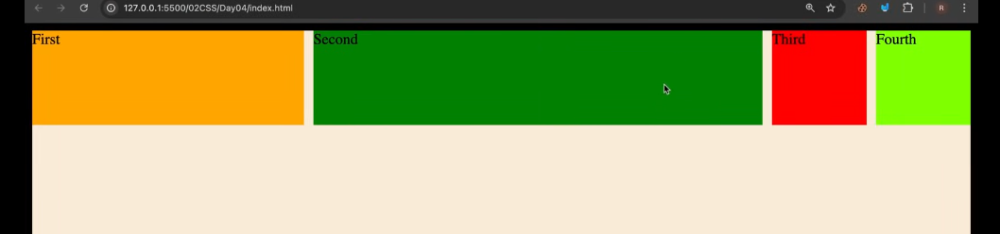
###### Flex-shrink : 
Flext-shrink হলো আমরা যখন inspect এ গিয়ে display কমাতে চাই তাহলে যে children টাকে দিবো সেটা আগে ছোট হবে । 
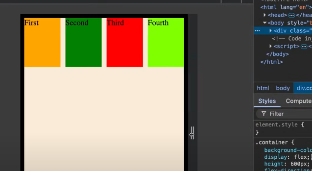
###### Flex-basis : 
children এর যে element টাকে দিবো তার সাইজ override হয়ে যাবে 
flex-direction : row --> width increase হবে 
flex-direction : column -> column increase হবে । 
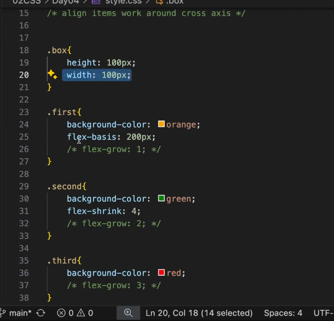
**when flex-direction : row and when we use flex-basis on any child that time it's apply width wise** 
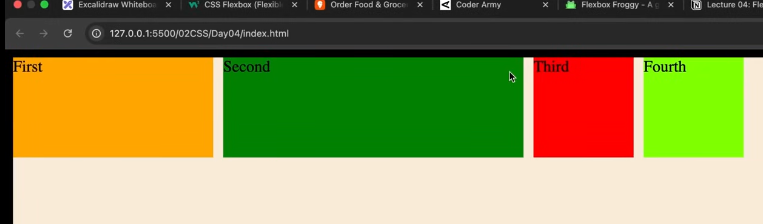
**when flex-direction : column and when we use flex-basis on any child that time it's apply hight wise** 
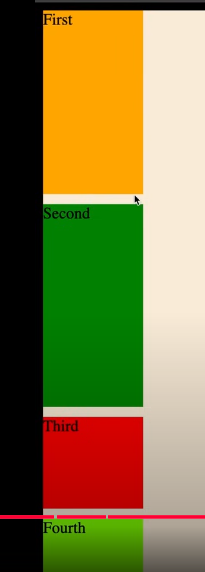

###### align-self : 
একটা children নিজের মতো করে পরিবর্তন হয়ে থাকে । 
**align-self : flex-end**
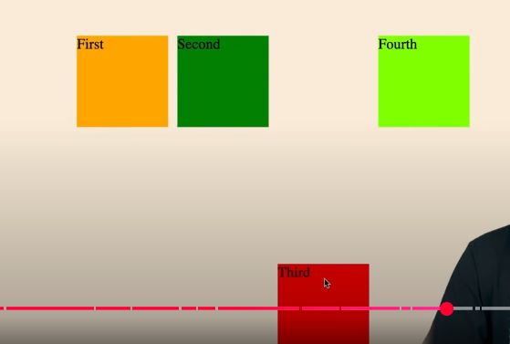
**align-self : flex-start**
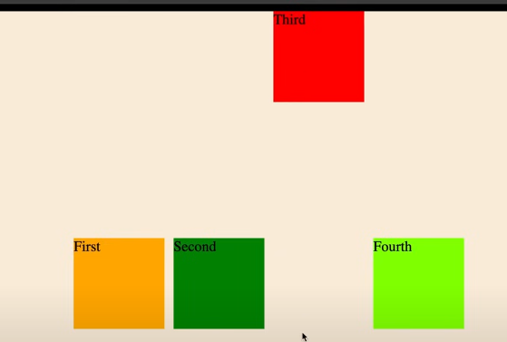
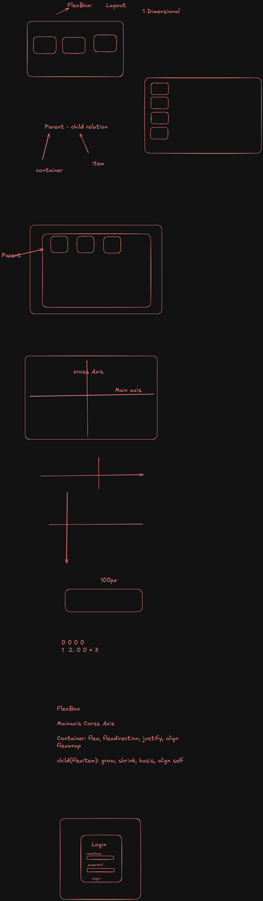

