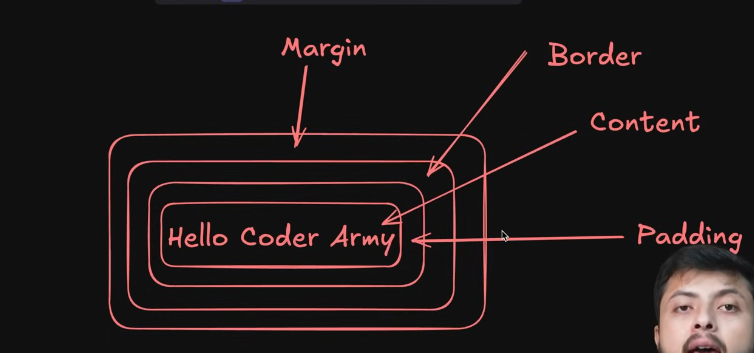

আমরা যখন কিছু element লিখি  তখন আমরা rectangler box-content create হয় । 
```html
<style>
h1{
    width : 100px;
    height : 100px ;

    /* border-width : 100px;
    border-style : solid; 
    border-color : red; 
      */
    border : 100px solid red; 
    padding : 10px;
    margin : 20px; 
    
}    
</style>
<h1>Hello Krishna</h1>
```

আমরা যখন কোন কন্টেন্ট লিখি তখন তা প্রথম একটা কন্টেন্ট create হয় তা height widht দিলে তা content এর হয় তারপর তাতে padding -> border -> margin হয় । 


#### Difference Between Block level Element & Inline element 

1. Block level element নতুন লাইনের থেকে শুরু হয় । আর inline element একই লাইনে থাকে আর space যখন আর না থাকে তখন তা নতুন লাইনে চলে যাই । 

যেমন ঃ 

```html 
<p>Hello world </p> 
<p>Hello world </p> 
<p>Hello world </p> 

<span>Hellooo </span> 
<span>Hellooo </span> 
<span>Hellooo </span> 
<span>Hellooo </span> 
<!-- এখানে span inline block element
একই লাইনে থাকবে  -->
```

2.  Box content এ আমরা যখন height / widht দেই তখন তা content এ apply হয় কিন্তু আমরা যখন inline block element এ তা apply করি তখন তা apply হয় না 

```html
p{
    width: 200px ; 
    height : 200px;

}

span{
    width: 200px ; 
    height : 200px; 
    <!-- এইটা apply হবে না  -->
}
```

3. Inline element & Block element এ আমরা যখন margin & padding use করি তখন তা inline element এ  apply হয় just horizontally কিন্তু তা vertically হয় না । Inline element এ যখন আমরা apply করি তখন তা margin-top / bottom এইটা আমাদের content কে তার জায়গা থেকে নড়াচড়া করায় না কিন্ত তা bg-color দিলে দেখা যায় কিন্তু content এর position এর পরিবর্তন হয় না । 


### Difference Between Border-box & Content-Box 

আমরা যখন content-box ব্যবহার করি তখন তার উপর যখন আমরা width , height apply করি সেটা content এর height + width এর  মধ্যে যেমন apply হয় সাথে সাথে তা margin , padding সবগুলো তেও apply হয়ে থাকে  তাদের সাইজ । 

<br>

কিন্তু আমরা যখন border-box ব্যবহার করি তখন তা আমরা যে width , height দেই তা উপর হিসেব করে margin , padding apply হয় । 


