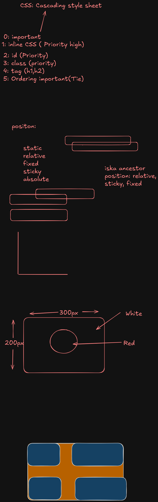

### cascadding rule 
#### Priority Of Inline , External & Internal Css 

0. Important Keyword
1. First Priority **INLINE CSs**
2. Internal & External Css According to Ordering . 

```Html
<style> 
</style>

<link> <!-- এইটা হবে কারন এইটা সবার শেষে --> 
```
এখানে inline css সবার শেষে থাকলে inline হতো apply 

3. Id এর priority বেশি class এর থেকে , class এর priority বেশি Tag এর থেকে । 


### Position 




###### Static Position 

আমাদের by default সবগুলো content static থাকে । 

###### Sticky Position 


ধরুন আমরা কোনো একটার position sticky দিয়ে দিয়েছি আর এইটা top : 20px দিয়েছি । তাহলে এইটা top এর ২০পিক্সেল থেকে আর সরবে না । 

###### Relative Position 

তার নিজের পজিশন থেকে দূরে সরে যাবে । 
কিন্তু তার জায়গার অন্য কোনো element আসতে দিবে না 

###### Fixed Position 

একটা পজিশনের গিয়ে ফিক্সড হয়ে থাকবে । 

like navigation bar position : fixed ;  top : 0px 

###### Absolute Position 

এই পজিশন হলো তার imidiate parent এর position : relative এর থেকে apply হবে । 

###### Z-Index 
Z-index যার বেশি সেটা দেখা যাবে । 