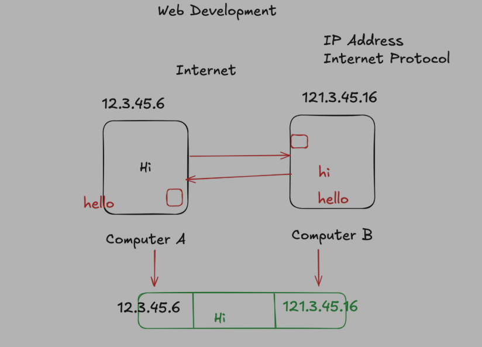
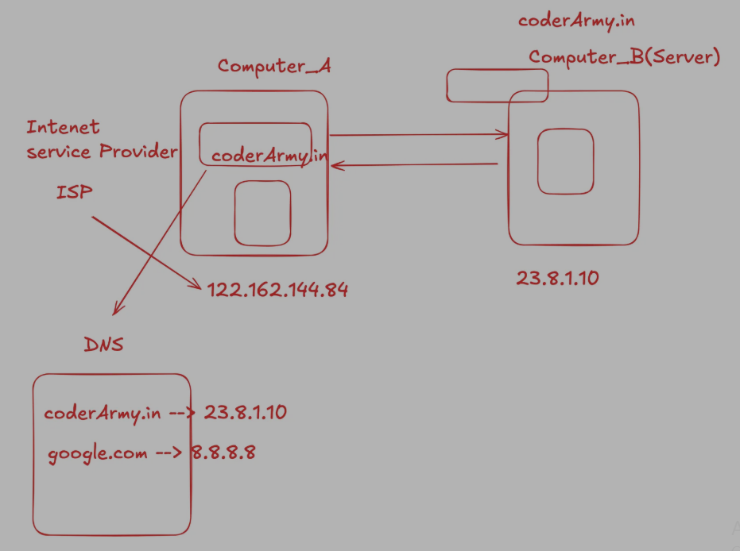
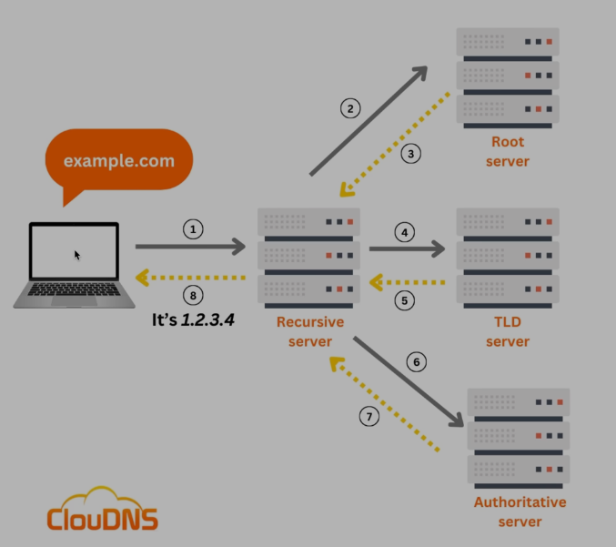
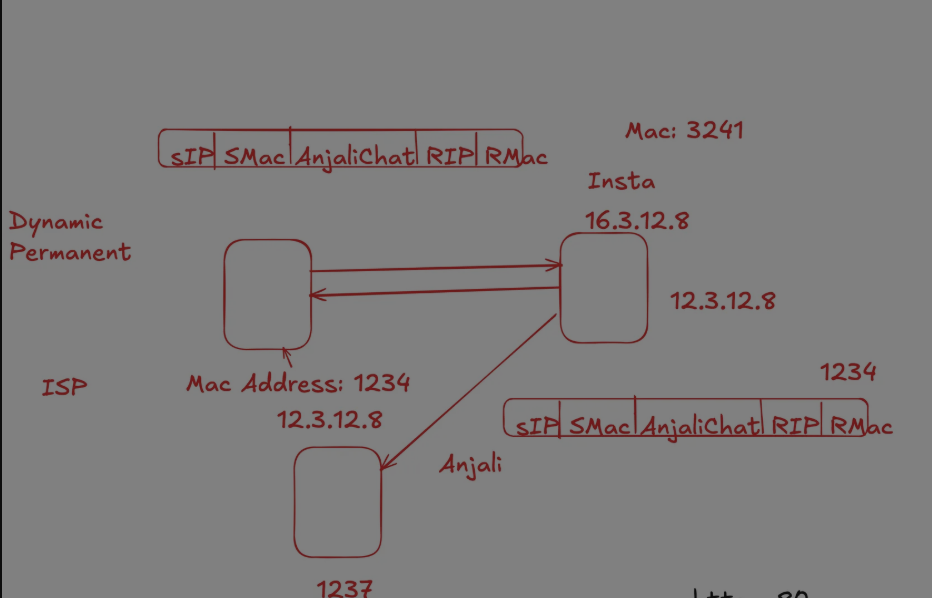
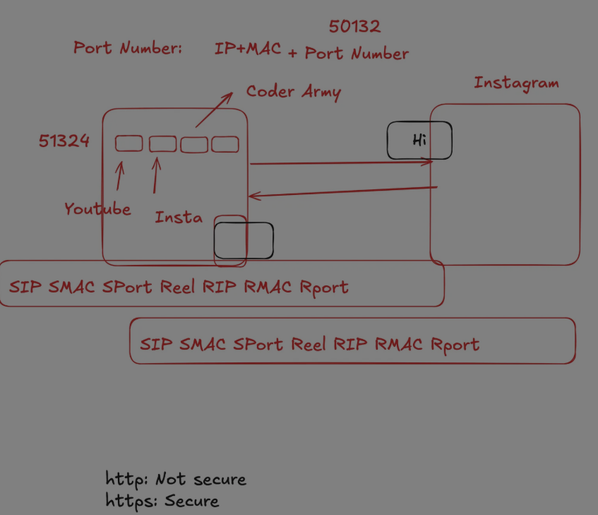

# Internet Working

[How to Access Website](#how-to-access-website)
#### How To Access Website 

ধরি একজনের কাছে কেউ উপহার পাঠাতে চাই এখন কেউ যদি উপহার পাঠাতে চাই তাহলে  যার কাছে উপহার পাঠাবো তার address আমার জানতে হবে । 

এখন ধরি এক কম্পিউটারের থেকে আরেক কম্পিউটারে যোগাযোগ করতে চাচ্ছি তাহলে আমার দুইটা কম্পিউটারের ip address (internet protocol) use করতে হবে । 




#### How To Access Website & Concept Of DNS 



computer যখন internet এর সাথে connect হয় ISP (Internet Service Provider) একটা IP Address দেয় । 

computer এর এই ip address permanent না , এটা এক এক সময় এক একটা হতে পারে যখন আবার নতুন করে internet এর সাথে connect হবো তখন । 

এটা হতে পারে computer_A কে যে ip address টা দিয়েছে internet service provider (isp) এটা আবার অন্য কোনো computer এ ও দিতে পারে যখন এই computer_a disconnected হয়ে যাবে । 


এখন ধরি আমি একটা website visit করতে চাচ্ছি কিন্তু এই ওয়েবসাইট টা একটা server এ আছে । [Server মানে একটা computer (Virtual Computer)] . এখন সমস্যা হলো আমরা কিছুক্ষন আগে দেখেছি আমরা যদি একটা কম্পিউটার থেকে আরেকটা কম্পিউটারের সাথে যোগাযোগ করতে চাই তাহলে আমাদের ip address এর দরকার হয় । এখন আমি যে website টা visit করতে চাচ্ছি তার name লিখে আমার browser এ search দিলে কিন্তু চলে আসছে but এটা কিভাবে । 
সেটা হলো DNS (Domain Name System) এর জন্য । DNS এ প্রতিটা ওয়েবসাইটের ip address থাকে । 

এখন আমরা ওই ওয়েবসাইটের সার্ভারে request পাঠাবো আর এই সার্ভারটা আমাকে আমার request এ response পাঠাবে এই ওয়েবসাইট টা হিসেবে আর অবশেষে website আমার browser এ show করবে  । 


###### In Depth Of Dns 


first of all যখন একটা website search দেই browser এ browser check করে এখানে আছে কিনা এই website এর ip address টা । 

যদি না থাকে তাহলে তা খুজে Recursive Server এখানেও না থাকলে তা খুজা শুরু করে প্রথম Root Server এ । 

13 টা Root Server আছে যে Root server কাছাকাছি তার কাছে প্রথম খুজে । Root Server এর কাছে থাকে .com , .in . এগুলো Detect করে আর সে পাঠায় আবার TLD Server এ । 

এখন browser থেকে যে website search দেওয়া হয়েছে সেটা যদি .com হয় তাহলে TLD SERVER এর .com  server  এ খুজা শুরু করে সেও final answer দেয় না সে আবার পাঠায় Authoritive Server । 

then finally found the ip_address your website . 


# Problem In Data Address And Mac Address 

MAC - MEDIA ACCESS CONTROL (Permanent Address)



ধরি আমার মোবাইল থেকে আমার ig তে ঢুকে আমার আর আমার ফ্রেণ্ডের মেসেজ দেখার জন্য request পাঠিয়েছি  intagram server এ ।

এখন আমরা জানি isp server যে আমাদের ডিভাইসে ip_address টা দেয় সেটা permanent না । 

আমাদের ডিভাইস যদি internet থেকে disconnected হয় সেটা আমাদের থেকে isp নিয়ে নেয় । 

এখন ধরি আমি req পাঠিয়ে দিলাম আর req পাঠানোর moment এ আমার internet disconnected হয়ে গিয়েছে আর আমার এই ip_appdress আমার বাবার মোবাইলে সেট হয়ে গিয়েছে এখন কি req কি আমার বাবার মোবাইলে চলে আসবে - **না** কারন আমাদের ip address permanent না কিন্তু আমাদের প্রত্যেক্টা device এ নিজিস্ব mac address আছে সেটা permanent Address আর তা change হয় না এর জন্য request পাঠানোর সময় ip address   + mac address (permanent address ) দিয়ে request পাঠায় আর sender request send করার সময় ip + mac address দুইটাই পাঠায় তাই এই সমস্যা আমরা face করি না ip_address change হলেও । 


### What Is Port Number 



আমরা তো দেখলাম আমরা যখন কোন সার্ভারে request পাঠায় তখন তা আমাদের Ip address + Mac Address পাঠায় সার্ভারে । 
 এখন আমি যদি কোন ব্রাউজারের থেকে request পাঠায় আর আমাদের ব্রাউজারে একটা tab এ Instagram আরেকটা তে Youtube server । এখন  সার্ভার যখন আমাদের  ব্রাউজারে request অনুযায়ী reply দিবে তখন সে কি করে বুঝবে browser এ কোন ট্যাবে এই রেকুয়েস্ট টা রান করবো । এর জন্য দরকার হয় port number . আমরা যখন request দেই তখন তা ip_address + mac_address + port number দেয় আর এই port number এর কারনে বুঝতে পারে সার্ভার কোন tab এ run করবে website . 

 


 # IPv4 Vs IPv6 


 

```
 IPV4 : 32 bit এর হয়ে থাকে যা সর্বনিম্ন ০০০০০০০০ -  ০
        ১১১১১১১১১ -২৫৫ 
```
ipv4 430 core device এ ip adress দিতে পারে কিন্তু  বর্তমানে ১০ হাজার কোটির উপর ডিভাইস আছে তাই এর জন্য দরকার ipv6 যা ৪৮ বিট 2^48 device কে দিতে পারে । 


### Mac Address 

একটা device এ mac address একটা হয় না । একটা ডিভাইসে যত ভাবে share option থাকে তত টা mac address থাকে । 

যা ৪৮ বিটের হয় । ২ টা ২ টা করে থাকে । 

