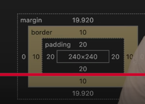

### Css Type 
Css 3 Types :
- inline 
- Internal 
- External 

```css

<p style ="background-color: red">Hello</p>

background-color - property 
: red - property value 
```

- Internal Css 

```html
<style>
h1{
    background-color : red ;
}
</style>
```

### Selector 


Element Selector - when we select tag 

id selector - unique represent it's represent . 

class selector it's represent # 

Group selector  , 
h1, #hello , .th{
    background-color : red ;
}

it's called * (universal selector)


### RGB Color 

Memory usage of RGB color 8 bit *3  - 24 bit / 3 byte 

rgb value - 
red  (0-255) 
gree (0-255)
blue (0-255)

bit 11111111 - 255 
    00000000 - 0 

rgba - alpha it's means color ta koto tuku halka hobe ar koto tuku garo hobe . transparency <br> 

### HSL Color 

hsl 
- hue  (0 - 360) 0 is red , 120 is green, 240 is blue 
- saturation  (0- 100%) color er intensity bole 
- Lightness (0% to 100%)

0% ekebare black kore dibe 
100% ekebare white kore dibe 
50% normal color 


## Hexadecimal Color 

first 2 - red 
second 2 - green 
last 2 - blue 

hexadecimal e protital bit 4 bit kore hoye thake so eita  o 4 * 6 = 24  bit 

## Pixel 

pixel meaning - picture element

আমরা গুগল সার্চ দিলে 1 pixel - 1/96 inch দেখায় কিন্তু এইটা সঠিক না । 
 
কারন আমরা যখন একটা ছবি তুলি তা row আর কলামে ভাগ করে দেই। 

প্রত্যেক্টা ঘর একটা করে পিক্সেল হয়ে থাকে 

আর প্রতিটা পিক্সেল rgb color contain করে । 

এখন ধরি আমার মোবাইলে একটা পিক তুলার পরে তা ৯/৭ এ এসেছে আর এতে টোটাল ৯*৭ = ৬৩ টা পিক্সেল আছে । এখন মোবাইলের জন্য যে পিক্সেল সাইজ গুলো তা আমার কম্পিউটারে গেলে change হয়ে বেড়ে যেতে পারে । 
তাহলে এই 1/96 pixel এসেছে কিভাবে এটা count করা হয় এর জন্য কারন যে প্রথম পিক্সেল বানিয়েছিল এটা তার কম্পিউটারের সাইজের উপর Depend করে বানিয়েছিল 


## em unit 


em দিয়ে বোঝায় আমার parent এর সাইজের এতো গুন 2em হলে parent এর সাইজের 2 গুন 

```html
<style>
    ol{
        font-size : 2px; 
    }    
    li{
        font-size : 2em ; 
        /* mane ol parent er 2*2 - 4px  */
    }
</style>
<ol>
    <li class = "hl">Hello</li>
    <li class = "hl">hi</li>
</ol>
```

## rem unit 


```html

আমাদের রোট হচ্ছে html এখন html যত পিক্সেল হয় তার উপর ভিত্তি করে হবে । 

html{
    font-size : 20px
}

p{
    font-size : 2rem 
    <!-- এই প্যারাগ্রাফ এর সাইজ হয়ে যাবে ৪০ পিক্সেল  -->
}


```


### vw / vh (viewport width)

viewport width মানে এইটা যে সাইজ হবে তা Device এর screen এর  width এর  এতো percentage . 

li{
    font-size : 2vw ;
}

### Percentage Unit 
percentage কাজ করে parent এর সাইজের এতো percent . 


```html
<style>
ol{
    font-size :20px;
}    
li{
    font-size : 50% ; 
    /* mane ol parent er size er 50% mane 10px  */
}
</style>

<ol>
    <li>hello</li>
</ol>
```


### boxsizing 

boxsizing - border box এ content এর width & height থাকবে + padding + margin সব থাকবে । 

boxsizing - content-box এ content এর width & height থাকবে

content-box


